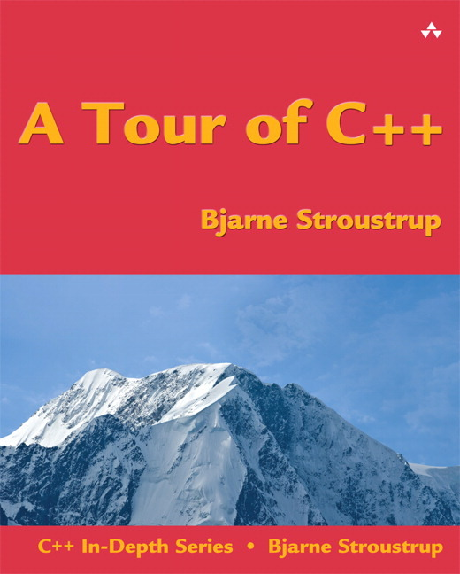
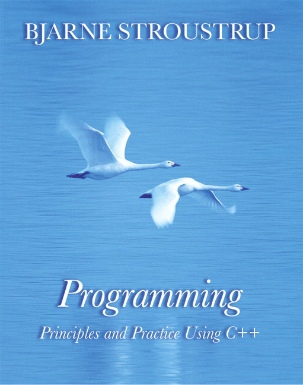
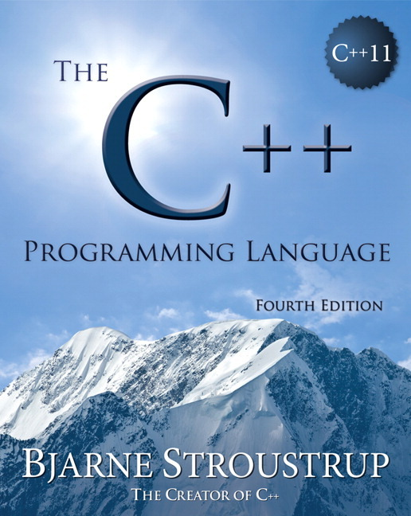

## Rubyish C++11

John Fearnside

john@moz.com

[github.com/jwfearn/rubyish](https://github.com/jwfearn/rubyish)


<p class="fragment">C++ isn't much like Ruby...</p>
<p class="fragment">and never will be...</p>
<p class="fragment">but it's getting a little closer</p>


## History
C++98 First ISO standard

C++03 Bug fix

C++11 First major revision (13 years later)


## C++11
Approved 12 August 2011

Many features have been available in major compilers for a while


## C++11 Available Now
- Apple LLVM 5.0
- clang 3.3
- gcc 4.8.1 (mostly)
- Visual C++ 2013


## What's new
<ul>
	<li class="fragment">Language features</li>
	<li class="fragment">Library features</li>
	<li class="fragment">Usability features</li>
</ul>


## Adoption
<p class="fragment">Existing code still works</p>
<p class="fragment">Compiler support relatively new</p>
<p class="fragment">New programmers leary</p>


Not your father's C++


Old guidance doesn't necessarily apply


## Blink example
<blockquote cite="http://dev.chromium.org/blink/coding-style#TOC-Other-Punctuation">
&ldquo;Prefer index over iterator in Vector iterations for a terse, easier-to-read code.&rdquo;
</blockquote>
<br/>
<br/>
Right:
```cpp
size_t frameViewsCount = frameViews.size();
for (size_t i = 0; i < frameViewsCount; ++i)
  frameViews[i]->updateLayoutAndStyleIfNeededRecursive();
```
<br/>
Wrong:
```cpp
const Vector<RefPtr<FrameView> >::iterator end = frameViews.end();
for (Vector<RefPtr<FrameView> >::iterator it = frameViews.begin(); it != end; ++it)
  (*it)->updateLayoutAndStyleIfNeededRecursive();
```
<br/>
<br/>
  -- [Blink style guide](http://dev.chromium.org/blink/coding-style#TOC-Other-Punctuation)


we'll come back to this


C++ *can* be simpler, like Ruby


## Dynamic Arrays
<p class="fragment">Array in Ruby</p>
<p class="fragment">std::vector in C++</p>


## Array Example in Ruby
`v.rb`
```rb
v = [-99, 0, 42, 3, -1, 6]
v.each do |iter|
  print "#{iter} "
end
print "\n"
```
<br/>
```
$ ruby v.rb
-99 0 42 3 -1 6
```


## Vector Example in C++98
`v0.cpp`
```cpp
#include <iostream>
#include <vector>

int main() {
  int arr[] = {-99, 0, 42, 3, -1, 6};
  std::vector<int> v(arr, arr + sizeof(arr) / sizeof(int));
  std::vector<int>::iterator end = v.end();
  std::vector<int>::iterator iter = v.begin();
  for (; iter != end; ++iter) {
    *iter = 0;
    std::cout << *iter << " ";
  }
  std::cout << std::endl;
  return 0;
}
```
<br/>
```
$ ./run v0.cpp
0 0 0 0 0 0
```


## Vector Example in C++98
`v0.cpp`
```cpp
#include <iostream>
#include <vector>

int main() {
  int arr[] = {-99, 0, 42, 3, -1, 6};
  std::vector<int> v(arr, arr + sizeof(arr) / sizeof(int));
  std::vector<int>::const_iterator end = v.end();
  std::vector<int>::const_iterator iter = v.begin();
  for (; iter != end; ++iter) {
    *iter = 0;
    std::cout << *iter << " ";
  }
  std::cout << std::endl;
  return 0;
}
```
<br/>
```
$ ./run v0.cpp
v0.cpp:10:11: error: read-only variable is not assignable
    *iter = 0;
    ~~~~~ ^
1 error generated.
```


## Vector Example in C++98
`v0.cpp`
```cpp
#include <iostream>
#include <vector>

int main() {
  int arr[] = {-99, 0, 42, 3, -1, 6};
  std::vector<int> v(arr, arr + sizeof(arr) / sizeof(int));
  std::vector<int>::const_iterator end = v.end();
  std::vector<int>::const_iterator iter = v.begin();
  for (; iter != end; ++iter) {
    std::cout << *iter << " ";
  }
  std::cout << std::endl;
  return 0;
}
```
<br/>
```
$ ./run v0.cpp
-99 0 42 3 -1 6
```


## Vector Example in C++11
v1.cpp
```cpp
#include <iostream>
#include <vector>

int main() {
  //...
  std::cout << std::endl;
  return 0;
}
```


Initialization Lists

Uniform Initialization


## Vector Example in C++11
C++98:
```cpp
int arr[] = {-99, 0, 42, 3, -1, 6};
std::vector<int> v(arr, arr + sizeof(arr) / sizeof(int));
```


## Vector Example in C++11
C++98:
```cpp
int arr[] = {-99, 0, 42, 3, -1, 6};
std::vector<int> v(arr, arr + sizeof(arr) / sizeof(int));
```
<br>
C++11:
```cpp
std::vector<int> v{-99, 0, 42, 3, -1, 6};
```


Auto


## Vector Example in C++11
C++98:
```cpp
std::vector<int>::const_iterator iter = v.begin();
```


## Vector Example in C++11
C++98:
```cpp
std::vector<int>::const_iterator iter = v.begin();
```
<br>
C++11:
```cpp
auto iter = v.begin();
```


Range-based for


## Vector Example in C++11
C++98:
```cpp
std::vector<int>::const_iterator end = v.end();
std::vector<int>::const_iterator iter = v.begin();
for (; iter != end; ++iter) {
```


## Vector Example in C++11
C++98:
```cpp
std::vector<int>::const_iterator end = v.end();
std::vector<int>::const_iterator iter = v.begin();
for (; iter != end; ++iter) {
```
<br/>
C++11:
```cpp
for (auto iter : v) {
```


## Vector Example in C++11
```cpp
std::vector<int> v{-99, 0, 42, 3, -1, 6};
for (auto iter : v) {
 	iter = 0;
  std::cout << iter << " ";
}
std::cout << std::endl;
```
<br/>
```
$ ./run v1.cpp
0 0 0 0 0 0
```


## Vector Example in C++11
```cpp
std::vector<int> v{-99, 0, 42, 3, -1, 6};
for (const auto & iter : v) {
	iter = 0;
  std::cout << iter << " ";
}
std::cout << std::endl;
```
<br/>
```
$ ./run v1.cpp
v1.cpp:7:9: error: read-only variable is not assignable
        iter = 0;
        ~~~~ ^
1 error generated.
```


## Vector Example in C++11
```cpp
std::vector<int> v{-99, 0, 42, 3, -1, 6};
for (const auto iter : v) {
  std::cout << iter << " ";
}
std::cout << std::endl;
```
<br/>
```
$ ./run v1.cpp
-99 0 42 3 -1 6
```


## Rubyish?
C++11:
```cpp
std::vector<int> v{-99, 0, 42, 3, -1, 6};
for (const auto & iter : v) {
  std::cout << iter << " ";
}
std::cout << std::endl;
```
<br/>
Ruby:
```rb
v = [-99, 0, 42, 3, -1, 6]
v.each do |iter|
  print "#{iter} "
end
print "\n"
```


## Blink example (reprise)
"Right":
```cpp
size_t frameViewsCount = frameViews.size();
for (size_t i = 0; i < frameViewsCount; ++i)
  frameViews[i]->updateLayoutAndStyleIfNeededRecursive();
```


## Blink example (reprise)
"Right":
```cpp
size_t frameViewsCount = frameViews.size();
for (size_t i = 0; i < frameViewsCount; ++i)
  frameViews[i]->updateLayoutAndStyleIfNeededRecursive();
```
<br>
BETTER:
```cpp
for (auto& view : frameViews) {
  view.updateLayoutAndStyleIfNeededRecursive();
}
```


## Other Rubyish features
optional garbage collection

lambdas


## Coming soon (C++14, C++17)
modules

optionals

file system library


## Resources & Books




more coming soon
